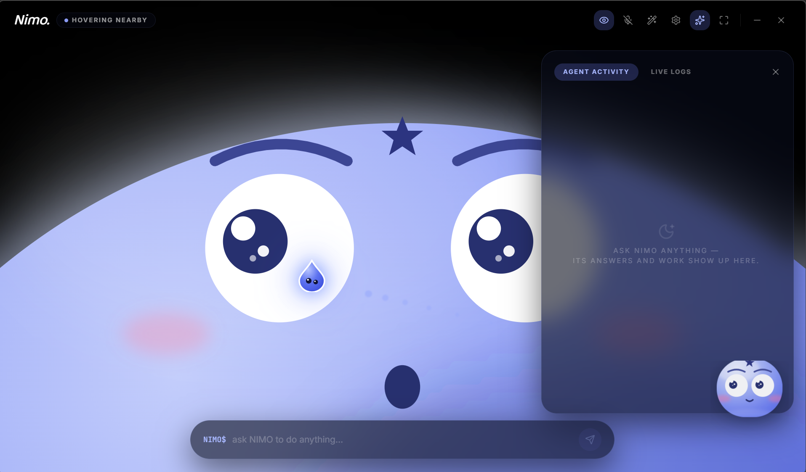
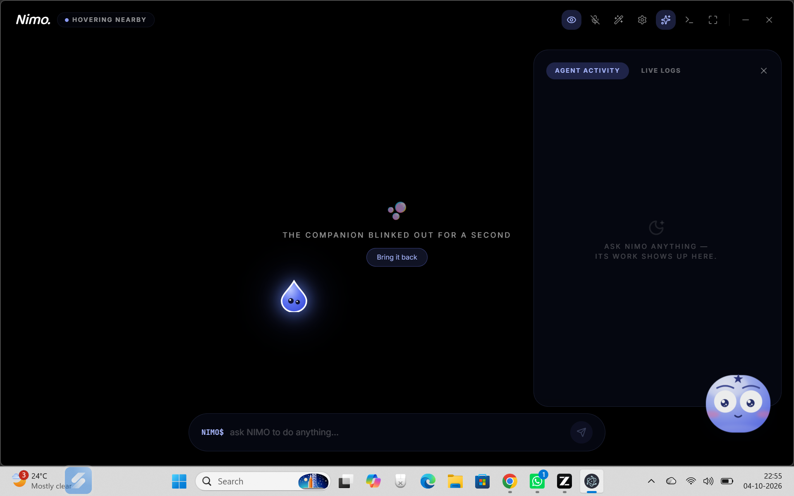

# NIMO — Your Floating Desktop Companion 🌟

<p align="center">
  
</p>

NIMO is a **cartoon AI companion that lives on your PC** — a giant glossy blue character with huge googly eyes that rises from the bottom of a **full-screen black stage**, tracks your mouse with its pupils, listens for **"Hey NIMO"** (in English or Hindi), talks through your speakers, sees your screen, moves your mouse, clicks real UI elements, writes files — and asks for your **approval** before anything critical. A real agent layer between you, the OS and the web.

Not a chatbot in a tab. A companion on your desktop.

<p align="center">
  
</p>

> 🎨 The character design (blue dome, star, googly eyes, blush, pointer buddy) is NIMO's own SVG recreation, inspired by the aesthetic of [bluey-by-riley](https://github.com/rbrown101010/bluey-by-riley) — all code here is original React/SVG.

| Package        | Role                                                                 |
|----------------|----------------------------------------------------------------------|
| `nimo-backend` | Electron shell (floating overlay + dashboard), Gemini function-calling **agent brain**, OS services, computer control, screen vision, HTTP API |
| `nimo-os`      | React + Vite UI — the full-screen character stage, the floating overlay, glass panels |

---

## ✨ What NIMO can do

### 🧠 Agent brain (Gemini function calling)
- **Chains tools like a real agent** — "open Notepad and write a comment for me" means: launch the app → type the text, up to 8 tool rounds per request.
- **Live weather** (Open-Meteo), **factual answers** (Wikipedia), **deep research** (multi-page search + cited briefing), **web search** with inline results.
- **Clarifying questions** — when a request is ambiguous, NIMO asks one short question back (the UI shows *"needs your answer"*) and continues the task when you reply.
- **Session memory** — *"and what about Tokyo?"* after a Delhi weather query just works.
- **English & Hindi only** — replies mirror your language (Hinglish in, Hinglish out); other scripts are filtered out everywhere.

### 🖥️ OS layer
- **Opens local files and folders** — "open C:\...\report.pdf" opens the PDF with its default app (document/media/text allowlist; executables refused).
- **Launches your actual installed apps** — scans the Start Menu, fuzzy-matches what you said, opens the real shortcut (shell-free launch — no command injection possible).
- **Finds and reads files** by name or content in your own folders (Desktop, Documents, Downloads, Pictures, Music, Videos) — capped and read-only.

### 🖱️ Computer control + screen vision
- **Sees your screen** — `find_on_screen` captures the display and asks Gemini's vision model to locate a described element ("the first video result"), returning real coordinates.
- **Moves the mouse, clicks, scrolls, presses key combos** — shell-free PowerShell with integer-only arguments (no command injection).
- **Computer-control mode** (Settings toggle): **ask first** (default — every click/press shows an approval card) or **granted** (hands-free automation for the session).

### ✍️ Gated writes (brain-checked)
- **Creates and edits text files** in your own folders — notes, markdown, code, config.
- **Types into the app you have focused** — comments in Notepad/VS Code/a browser field.
- **The safety core** judges every write twice: hard rules (your folders only, executables blocked, destructive/secret-stealing patterns refused, size caps) **plus** an LLM verdict (benign / suspicious / malicious). Benign new files run immediately; overwrites, flagged content and typing show an **approval card** first. Declining always works; hard blocks can't be overridden.
- **Never deletes files. Never downloads anything.**

### 🌐 Real-time web (safe by construction)
- Every outbound request flows through a **network guard**: only `http/https`, host validated before connecting, **localhost / private / reserved IP ranges refused**.
- Keyless APIs (Open-Meteo, Wikipedia, DuckDuckGo) so it works out of the box; Gemini powers the reasoning.

### 🎤 Voice (works inside the app)
- **Gemini-powered listening** — Electron doesn't ship Chrome's speech backend, so NIMO records your mic (voice-activity detection), encodes WAV in-app and transcribes with your Gemini key. English and Hindi.
- **Wake word** (`hey nimo`) on by default, or open-mic mode. The mic auto-ducks while NIMO speaks so it never hears itself.
- **ElevenLabs speech** (soft "Alice" voice) with automatic fallback to the OS voice — free ElevenLabs plans can't use library voices via API; set `ELEVENLABS_FALLBACK_VOICE_ID` in `.env` with a custom voice, or upgrade to unlock "Alice".

### 🎈 The companion experience
- **Floating overlay**: a tiny transparent window hugging the creature exactly — drag it anywhere (it stays put, corners included), pin/unpin for click-through, eyes following your cursor, speech bubble, approval cards, voice controls.
- **Full-screen dashboard stage**: the dome character over a black cinematic stage with a glow halo, plus floating glass panels — Agent Activity (ChatGPT-style markdown answers + work timeline + result cards), Live Logs, OS Tools, Settings (mood, glow, toggles).
- **Expressions**: curious idle → auto-sleep with Zz, wide-eyed listening, thinking dots, talking mouth, happy squint, sly side-glance, red-halo error, music notes.
- **Pointer buddy** — a tiny teardrop comet that chases your cursor (toggleable).
- Logs wipe on every app start; a fresh session every time.

### 🛡️ Safety envelope
- No file deletes, no downloads, no system folders, no executables.
- Writes and input automation are approval-gated (or granted explicitly by you).
- Web access is public-host-only; screenshots stay on your machine.
- `.env` API keys live in the OS keychain, gitignored and never synced.

---

## 🚀 Quick start

```bash
# 1. Backend deps (Electron + services)
cd nimo-backend
npm install

# 2. UI deps
cd ../nimo-os
npm install

# 3. Run the app (UI dev server + Electron with floating companion)
cd ../nimo-backend
npm run dev
```

- The **companion** appears floating over your screen — drag it anywhere.
- The **dashboard** opens as a normal window (fullscreen toggle in the header, `Ctrl+Alt+N` to bring it back, tray icon always available).
- Say **"Hey NIMO, what's the weather?"** or type in the `nimo$` terminal.

### Headless / browser-only dev
```bash
cd nimo-backend && node server.js   # agent API on :3001
cd nimo-os && npm run dev           # UI on :3000 (proxies /api → :3001)
```

### Gemini API key
Put `GEMINI_API_KEY=...` in `nimo-backend/.env` (or set it in the UI settings) — it is migrated into the OS keychain on first launch. Add `ELEVENLABS_API_KEY=...` for the ElevenLabs voice.

---

## 🧭 Architecture

```
┌────────────────────────┐      ┌─────────────────────────────┐
│  Companion overlay     │      │  NIMO OS dashboard          │
│  tiny, transparent,    │      │  full-screen character      │
│  always-on-top         │      │  stage + glass panels       │
│  drag · pin · voice    │      │  markdown answers · logs    │
└──────────┬─────────────┘      └──────────────┬──────────────┘
           │  Electron IPC (window.nimo)       │  /api/* (proxy)
           ▼                                   ▼
┌─────────────────────────────────────────────────────────────┐
│  Electron main · tray · global mouse poll · HTTP API :3001  │
│─────────────────────────────────────────────────────────────│
│  core/agent.js       Gemini tool loop + sessions + approvals│
│  core/agentTools.js  the ONLY action surface (24 safe tools)│
│  services/web        liveData (weather/knowledge) · research│
│  services/system     appFinder · fileSearch · textWriter ·  │
│                      keyTyper · computerControl · screenVision
│  services/guard      safeFetch (public-host-only gateway) · │
│                      writeGuard (rules + AI verdict)        │
│  core/pendingActions approval gate for critical actions     │
└─────────────────────────────────────────────────────────────┘
```

**Voice flow:** microphone → VAD recording → Gemini transcription → wake-word check → `/api/agent` → Gemini decides → tool calls execute (approval cards for critical ones) → ElevenLabs/OS voice + face expression + rich cards.

## 📁 Key files

| File | Purpose |
|------|---------|
| `nimo-backend/core/agent.js` | Agent loop: tools, sessions, `[CLARIFY]`, approvals |
| `nimo-backend/core/agentTools.js` | The complete, safe action surface |
| `nimo-backend/core/httpApi.js` | Shared HTTP routes (Electron + headless) |
| `nimo-backend/services/guard/safeFetch.js` | Outbound network guard |
| `nimo-backend/services/guard/writeGuard.js` | Write safety core (rules + AI verdict) |
| `nimo-backend/services/system/computerControl.js` | Mouse / keyboard automation |
| `nimo-backend/services/system/screenVision.js` | Screenshot → Gemini vision → coordinates |
| `nimo-backend/electron/main.js` | Overlay + dashboard windows, mouse feed, tray |
| `nimo-os/src/components/NimoFace.tsx` | The full-stage character (static SVG tree) |
| `nimo-os/src/components/FloatingBlob.tsx` | The tiny floating companion |
| `nimo-os/src/overlay/OverlayApp.tsx` | The floating companion widget |
| `nimo-os/src/hooks/useNimoAgent.ts` | Shared brain: agent calls, voice engines |

## 🧪 Tests

```bash
cd nimo-backend && npm test          # node --test (43 tests)
cd nimo-os && npm run lint           # tsc --noEmit
```
